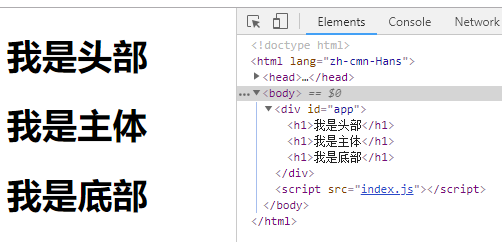
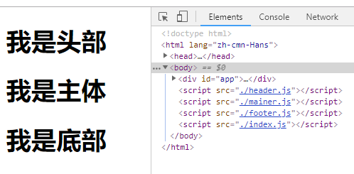

# webpack 4.0

## 一、初识webpack

### 1.webpack 它究竟是什么？

> 首先做一个简单的程序编写

` index.html`

``` html
<html>
    <head>
        <title>webpack学习</title>
    </head>
    <body>
        <div id="app"></div>
        <script src="./index.js"></script>
    </body>
</html>
```

` index.js`

``` js
let app = document.getElementById('app')

let header = document.createElement('h1')
header.innerText = '我是头部'
app.append(header)

let mainer = document.createElement('h1')
mainer.innerText = '我是主体'
app.append(mainer)

let footer = document.createElement('h1')
footer.innerText = '我是底部'
app.append(footer)

```

示例如下：




这时，我们就可以插入到了内部了。但是，随着内容的增大，代码的复用，代码的可读性等方面来考虑一个项目，所以，我们不得不用面向对象的方法来编程，或者分包的方式来编写程序。

如：

` header.js`

``` js
function Header() {
    let header = document.createElement('h1')
    header.innerText = '我是头部'
    app.append(header)
}
```

` mainer.js`

``` js
function Mainer() {
    let mainer = document.createElement('h1')
    mainer.innerText = '我是主体'
    app.append(mainer)
}
```

` footer.js`

```js
function Footer() {
    let footer = document.createElement('h1')
    footer.innerText = '我是底部'
    app.append(footer)
}
```

` index.js`

```js
let app = document.getElementById('app')
new Header()
new Mainer()
new Footer()
```

` index.html`

```html
<html>
    <head>
        <title>webpack学习</title>
    </head>
    <body>
        <div id="app"></div>
        <script src="./header.js"></script>
        <script src="./mainer.js"></script>
        <script src="./footer.js"></script>
        <script src="./index.js"></script>
    </body>
</html>
```


示例如下：




> 上述方式同样能达到效果，并拆分开来了。变得更好对每个js文件维护了。但有什么不好影响呢？

1. 每一个js文件都需要请求获取。
2. 途中哪个js文件有问题，难以定位(若把 index.js 和 footer.js 换位置会报 `Footer is not function `错误)

所以，我们要想个办法把 js 合并一下，并让结构更清晰。所以，我们先初用 为 `webpack `试试


首先，要下载 Node，没有Node的同学请[下载Node](https://nodejs.org/zh-cn/)，Node 会自带 npm 下包工具

然后，到一个自己的项目目录下打开 cmd，安装webpack

`npm install webpack webpack-cli -D`


> <u>疑点 ：webpack-cli 是什么？</u>（之后解答）


代码如下：

` header.js`

```js
function Header() {
    let header = document.createElement('h1')
    header.innerText = '我是头部'
    app.append(header)
}
export default Header
```

` mainer.js`

```js
function Mainer() {
    let mainer = document.createElement('h1')
    mainer.innerText = '我是主体'
    app.append(mainer)
}

export default Mainer
```

` footer.js`

```js
function Footer() {
    let footer = document.createElement('h1')
    footer.innerText = '我是底部'
    app.append(footer)
}
export default Footer
```

` index.js`

```js
import Header from './header.js'
import Mainer from './mainer.js'
import Footer from './footer.js'

let app = document.getElementById('app')
new Header()
new Mainer()
new Footer()
```

在命令行执行：`npx webpack index.js`

index.html`

```html
<html>
    <head>
        <title>webpack学习</title>
    </head>
    <body>
        <div id="app"></div>
        <script src="./dist/main.js"></script>
    </body>
</html>
```

效果等同于之前，我们来解释一下上面的代码。

``` js
/*
	import 是用于导入文件的，见 index.js。
	
	export 是用于导出内容的，至于是字符串，还是函数，还是对象都可以。加个 default 表示没有指定要导出什么内容时，自动导出这个default 的内容0，每个js 只能有一个 default，但能有多个 export。
	
	这里我们为什么没有直接运行，而是先执行 npx webpack index.js，目录下多出一个dist 文件夹，里面多出一个main.js 的问题件？并且，我们要在 index.html 中引入 main.js 呢？
	因为，浏览器不能识别 import 和 export 是 ES6 的模块化导包方式。
	import 和 export 是 ES6 的模块化导包方式，但是 webpack 能识别，所以，webpack 充当了翻译官的角色。他把你的index.js 的依赖关系解析后生成 浏览器能识别的内容。
*/
```

> 疑问：npx 又是什么呢？ 
>
> npx 就是一个临时的执行依赖包的指令，及时的完成自动打包。[详情请看](https://www.jianshu.com/p/cee806439865)


> 提问：那，webpack 完全就是一个翻译官，把浏览器的看不懂的文件编译成可以看懂的文件？
>
> 答：根据官网的解答：Webpack is a module bundler (webpack 是一个模块打包工具).简单来说，webpack 只能对模块内容进行打包。所以，他自身只能识别上述案例中的 import 和 export 。除了 ES Module 以外，它还能打包 CommonJS，CMD，AMD，会的同学不妨尝试修改一下，同样是能成功。
>
> 除此之外，我们发现在一些地方(如，脚手架)，webpack 还可以打包 css，font，image等等，我们只要安装相应的 plugin(插件) 和 loader(加载器) ，我们就可以把想打包的内容合并成一个或者几个文件。
>
> 所以，准确的理解就是，webpack 就是一个为把资源打包而生的工具。


### 2.webpack 的环境搭建

- `webpack`是基于nodejs 环境工作的。所以，我们需要先下载 nodejs。

[NodeJS 下载地址](https://nodejs.org/zh-cn/)

下载成功的标志：进入命令行输入 `node -v` 会出现版本号。`npm -v `  npm也会一同被安装。

- 接下来，创建一个文件夹作为项目根目录，并在文件夹中启动命令行工具。

输入 `npm init` 或者 `npm init -y`，这个指令是用来初始化包管理文件的命令，会在根目录生成一个 package.json 文件，里面描述的就是项目的相关配置信息，每个字段的[详情请看](https://www.cnblogs.com/whoismagin/p/5627308.html)

- 安装 `npm webpack webpack-cli -g` ，其实 -g 表示全局安装。

可能有安装不上，会很慢，是因为 npm 的数据获取源被屏蔽或者在国外，无法被正常下载。因此，我们可以切换我们的数据源来提升下载速度。[切换源的方式](https://blog.csdn.net/lin74love/article/details/78297808)

> P.S. 这样有一个注意事项就是，不建议 webpack 进行全局安装。因为如果有两个项目，一个是 webpack 3, 一个是 webpack 4， 这时候，如果不通过一些复杂的方式，你是启动不了 webpack 3的。如果，你既想启动 webpack 3 , 又想启动 webpack 4 ，便很难达到你想要的预期效果的。

因此，最好我们使用 `npm webpack webpack-cli -D`。

- 安装好后，在项目目录里会多一个 node_modules 文件夹，存放的就是所下载的依赖包的数据。

注：这个时候你输入 webpack -v 去测试是否下载成功，会报错。说指令不存在。因为这种方法会去全局目录查找是否有webpack 指令。既然都没安装全局，所以肯定没报 `指令不存在的错误信息`

> 那，如何去看是否安装成功呢？
> 通过指令 `npx webpack -v` 。使用 npx 会去项目中的 node_modules 中去查找是否有 webpack。


这个时候，webpack 就可以安装使用了~


### 3.webpack 的配置文件

​	之前我们用 `npx webpack index.js` 就可以打包了，但是如果不指定 index.js ，就不知道是哪个地址。

另外，我们的项目到底从哪个入口进入，从哪个出口输出，之前都是 webpack 默认的（为了开发体验更好，随着webpack 的升级，越来越多的默认配置）。

​	因此，我们要编写一个配置文件，这个配置文件配置在项目根目录选，名称为 `webpack.config.js`

`webpack.config.js`

```js
const path = require('path')	// node的内置对象，可以获取路径的相关信息

module.exports = {
    // entry: string | Array<String> | {[entryChunkName: string]: string|Array<string>}
    entry: './index.js',	// 打包的入口文件
    output:{				// 打包的出口文件
        filename: 'main.js',	// 打包后的文件名称
        path: path.resolve(__dirname, 'dist')	// 绝对路径下的dist目录内，默认也是这个地址
    }
}
```

​	这是执行 `npm webpack` 就会默认的根据此配置文件的配置进行打包

​	P.S. 需要注意的是，webpack.config.js 在根目录是默认配置项，如果自定义配置文件，可以使用

`npx webpack --config [自定义配置文件名].js`


​	到目前为止，我们可以通过配置文件打包了。但是，和我们使用的主流的脚手架使用 `npm run build` 这样的操作不相同。 那我们应该如何变得相同呢？

​	我们只需要在 package.json 的 scripts 字段中添加自己的指令即可。

​	例如：之前的配置我们采用：

`package.json`

``` json
{
    “scripts”: {
        "build": "webpack"
    }
}
```

​	这样就可以使用 `npm run build` 和我们之前的效果一样啦。等价于 执行 webpack 指令。

	> 可能有人会疑问，那这样的 webpack 不是全局的吗？
	>
	>在 scripts 中的执行会先从 node_modules 目录下去查询是否有这条指令，如果没有才会调用全局的。


